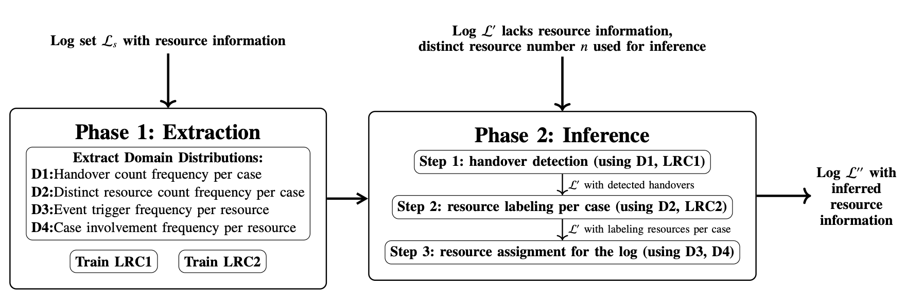

# Three-Step-Resource-Inference-Framework
Three-Step-Resource-Inference-Framework addresses the problems of assigning resource attributes to event logs that lack resource information. 
It contains two phases: the **Extraction** phase and the **Inference** phase.
In the **Extraction** phase, it extracts four domains and train two logistic regression classifiers from numbers of train logs.
In the **Inference** phase, it applies the domains and classifiers to infer resource attributes for event logs without the resource information.

## Prerequisites
1. You should add all train logs in the **train_log_set** package, for each train log, it should contain at least contain case (named as **case_id**), activity (named as **activity_type**), timestamp (named as **timestamp**), and resource attribute (named as **agent_id**).
2. You should add all test logs in the **test_log_set** package, for each train log, it should contain at least contain case (named as **case_id**), activity (named as **activity_type**), timestamp (named as **timestamp**). If the test log contains the ground truth resource attribute (named as **agent_id**), then you can run the evaluation code to get the inference accuracy.
3. The outputs will be stored in the default package (named as **generated_log_set**).
4. You should install **conda** that will be applied to create the environment.

## How to run the Three-Step-Resource-Inference-Framework
You should follow these steps:
1. Download the whole folder and open the terminal at this folder.
2. Run `conda create -n py311 python=3.11.4` to create the python environment.
3. Run `conda activate py311` to activiate the environment.
4. Run `conda install notebook ipykernel` to install the notebook in the environment.
5. Run `pip install -r requirements.txt` to install python packages.
6. Run `jupyter notebook` to open the jupyter notebook under this environment.
7. Open the file **three-step-resource-inference.ipynb** in the jupyter notebook page.
8. Set the parameters (i.e., the number of inferred resources) in the second cell.
9. Click run all cells and wait for the results.

## Running example
We use nine real-word Business Process Intelligence Challenges (BPIC) event logs as train set.
Then use another BPIC event log (**BPIC2011**) as the test log.
The middle output after **Step-2** and the final output after **Step-3** will be stored in the **generated_log_set**.
We also evaluate the inference precision, and also generate two resource inference results using two baseline approaches.

## Authors
Qingtan Shen, Artem Polyvyanyy, Nir Lipovetzky, Timotheus Kampik
